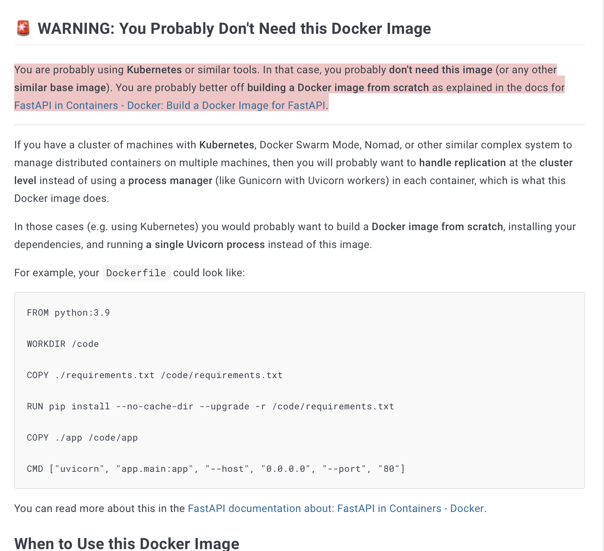
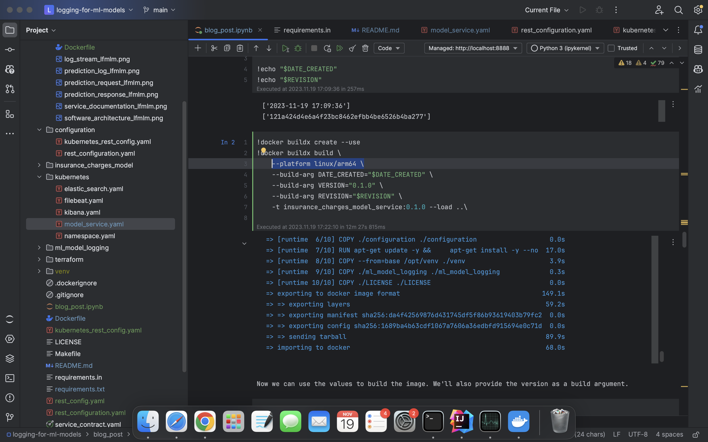
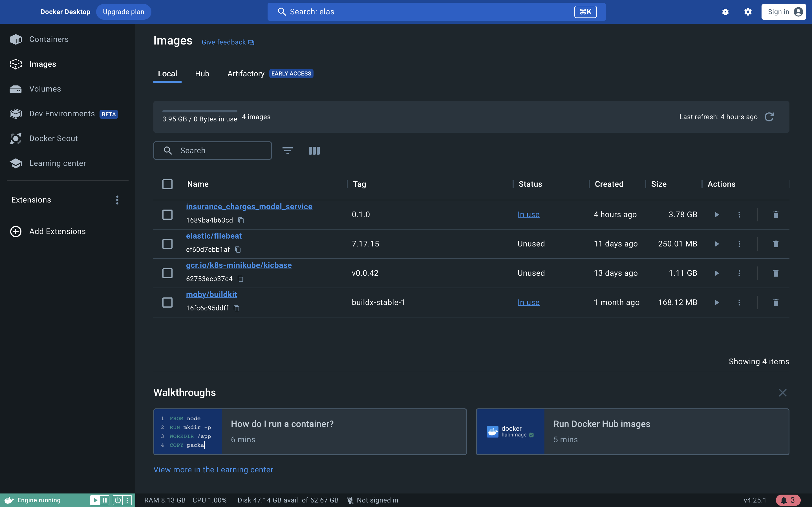
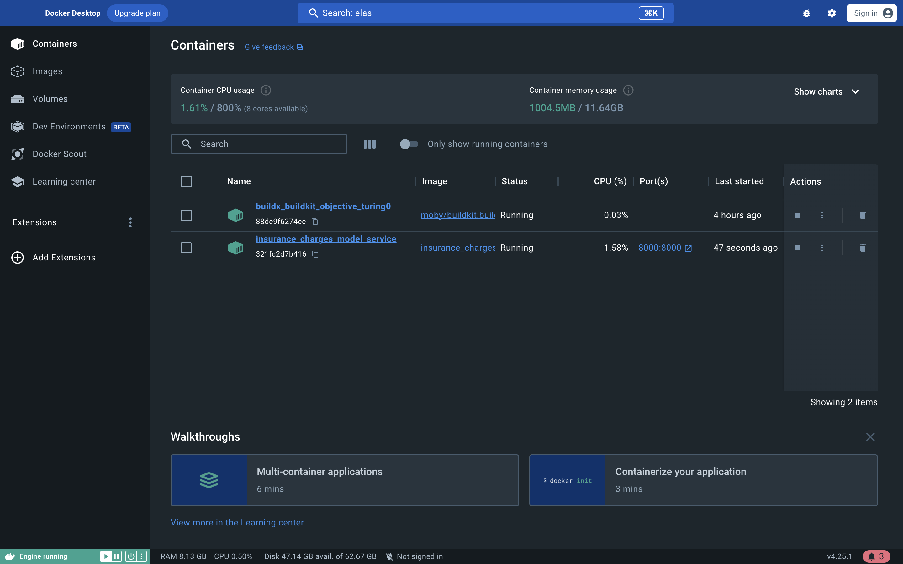
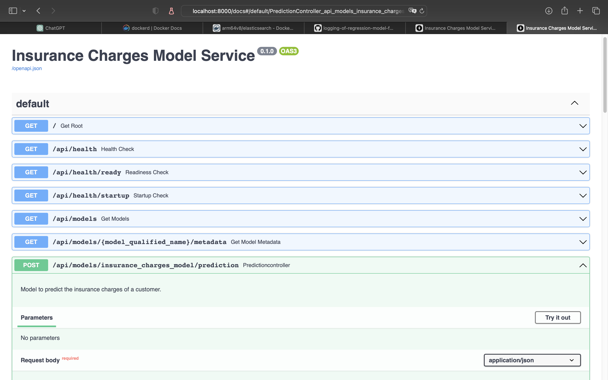
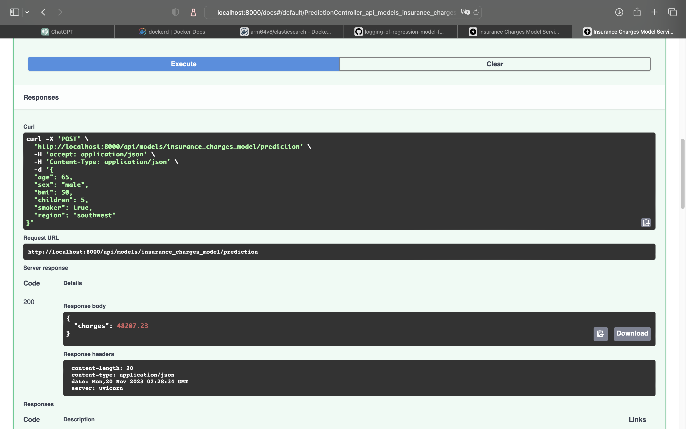
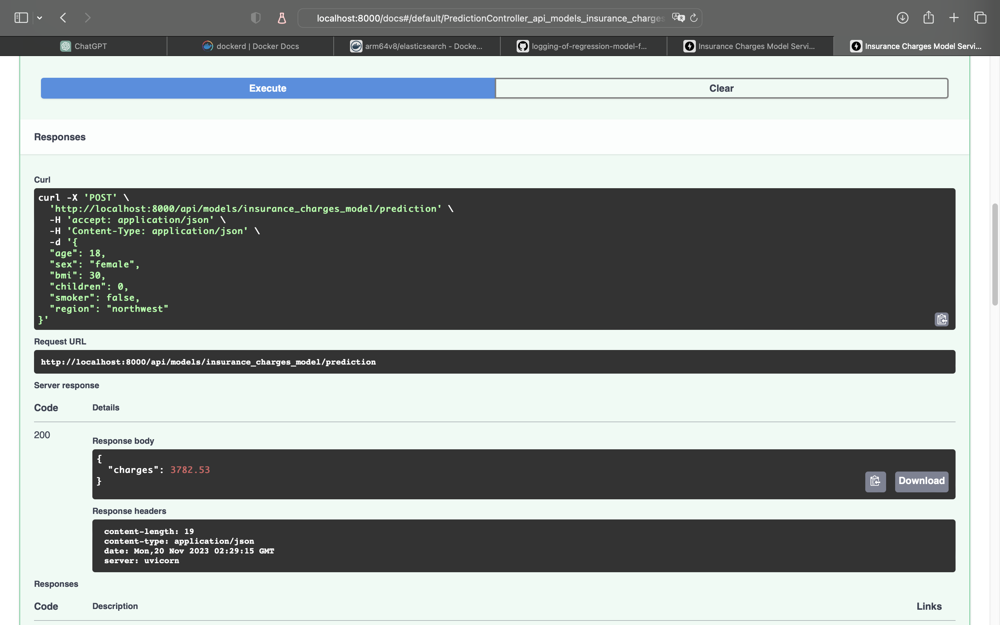
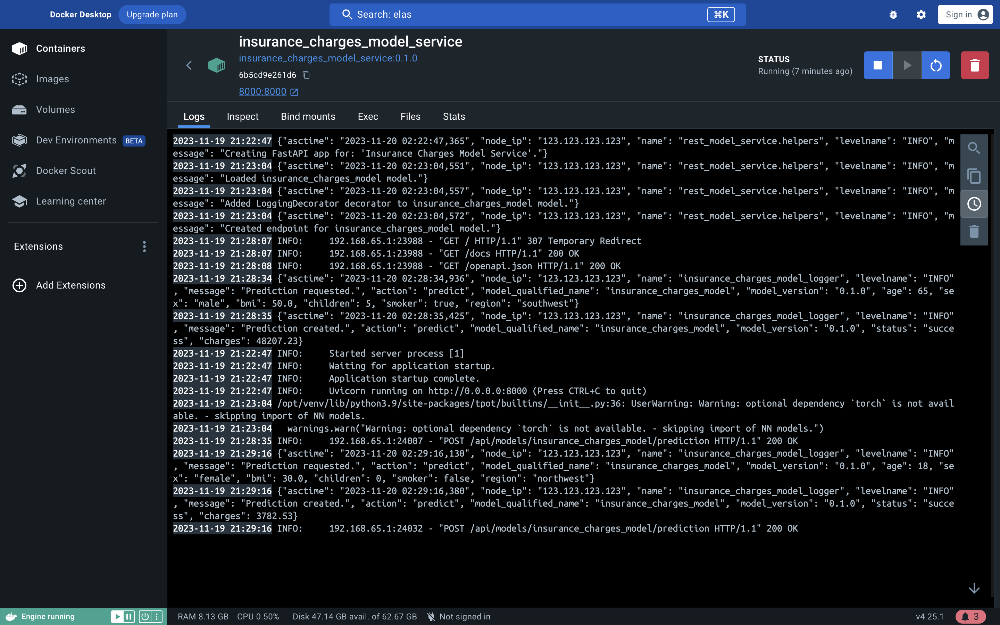
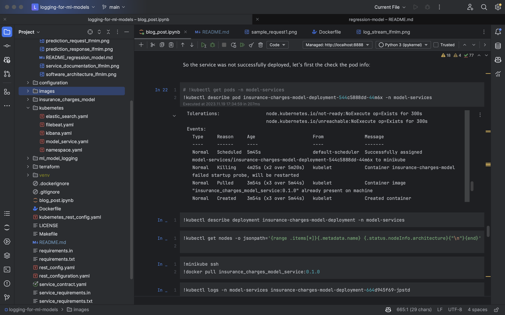
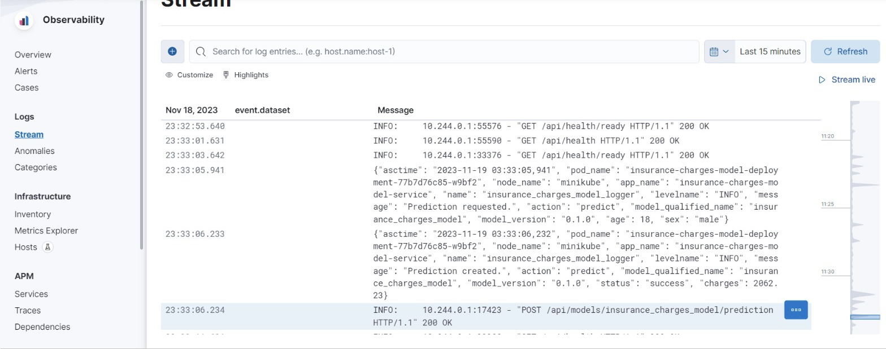

Titre: Load test pour le modèle de prédiction avec logger

Date: 14-12-2023

Auteur: Groupe 1 du cours MGL7320

Résumé: Une exigence courante pour les services RESTful est la capacité de continuer à fonctionner tout en étant utilisé par de nombreux utilisateurs simultanément. Dans cet article de blog, nous montrerons comment créer un script de test de charge pour un service de modèle d'apprentissage automatique (ML).

# Testons notre service de prédiction avec des fausses requêtes pour voir sa performance d'accueil les requêtes

## Introduction

Le modèle ML déployé doit répondre aux exigences du système dans lequel il est déployé. Les exigences qu'un système doit remplir sont souvent catégorisées en deux types :

Les exigences fonctionnelles : Les exigences fonctionnelles sont le comportement spécifique qu'un système.

Les exigences non fonctionnelles : Les normes opérationnelles que le système doit respecter pour accomplir ses tâches assignées.

Un exemple d'exigence non fonctionnelle est la latence du système, qui est le temps nécessaire pour qu'un système réponde à une demande de bout en bout.
Par exemple, nous avons besoin d'un service ML qui fait des prédictions dans 10 ms, sinon, le système n'est pas plus utile en pratique.

Les exigences non fonctionnelles peuvent être formulées en utilisant des INDICATEURS de niveau de service (SLI). Un SLI est une métrique mesurant un aspect de la fonction du système.

Un SLI doit être bien défini et compris à la fois par les clients et les opérateurs d'un système, car il forme la base des objectifs de niveau de service. Quelques exemples de SLI sont la latence, le débit, la disponibilité, le taux d'erreur et la durabilité.

Les OBJECTIFS de niveau de service (SLO) sont des exigences sur le fonctionnement d'un système mesurées à travers les SLI du système. Les SLO sont des moyens définis et convenus pour indiquer quand un système fonctionne en dehors des normes de performance requises.

Par exemple, lors de la mesure de la latence, un SLO valide pourrait être quelque chose comme ceci : "la latence du système ne doit pas dépasser 500 ms pour 90% des demandes". Lors de la mesure des taux d'erreur, un SLO pourrait indiquer "le nombre d'erreurs ne doit pas dépasser 10 pour chaque 10 000 demandes effectuées sur le système".


Les tests de charge sont le processus par lequel nous pouvons vérifier qu'un modèle ML déployé en tant que service est capable de respecter le SLA du service tout en étant soumis à une charge. Certains des SLI que nous mesurerons seront la latence, le débit et le taux d'erreur.

Détails d'implémentation dans le fichier : load_test.ipynb

Quelques captures d'écran de l'exécution du script de test de charge :


Malheureusement, la fonctionnalité de load test n'a pas pu être intégré au service déployé sur Kubernetes à cause d'un problème de configuration
sur les serveurs, pour le moment, nous déployons le service sur Docker avec succès, ce qui nous confirme le fonctionnement du code, 
le déploiement sur Kubernetes est en cours de résolution.

----------------------------------------------------------------------------------------------------------------------------


Titre: Logging of Regression Model for Insurance Charges

Date: 19-11-2023

Auteur: Félix Zhao

Résumé: Ajouter la fonctionnalité de logging au modèle de prédiction d'assurance

# Logging of Regression Model for Insurance Charges

Logging for machine learning models - Precisely for a model predicting insurance charges

# Last updated: Nov 19th 2021 at 11:50pm

## Requirements

- Python 3.9 or above (I used 3.9.6)

## Installation 

The Makefile included with this project contains targets that help to automate several tasks.

### Theres two part to this installation:
Start with part 2 first, if all is installed then skip part, if not the insurance charges model's installation is unsuccessful, come back and follow steps in part 1 
#### Part 1: Requirements for the regression model (insurance charges model)
Here's what i did:
This part requires its own dependency management, first to download it:

```bash
git clone https://github.com/felixzhaofelix/regression-models-fixed
```
And follow the instructions on its README.md, here's  a copy of it:
```bash
blog_post/README_regression_model.md
```
[Visit regression-model-fixed](https://github.com/felixzhaofelix/regression-model-fixed/blob/master/README.md)


```bash
logging-for-ml-models/blog_post/README_regression-model.md
```
Make sure the service can run with successful health checks on Docker and then we'll be ready for the next step

#### Part 2: Requirements for the logging decorator

To download the source code execute this command:

```bash
git clone https://github.com/felixzhaofelix/logging-for-ml-models
```

Then create a virtual environment and activate it:

```bash
# go into the project directory
cd logging-for-ml-models

make venv

source venv/bin/activate
```

To install the dependencies:

I replaced the credit risk model that was originally used on with the insurance charges model and
to do so I had first open the file:
```bash
logging-for-ml-models/requirements.in
```
and replace the following line:
```bash
-e git+https://github.com/schmidtbri/health-checks-for-ml-model-deployments#egg=credit_risk_model
```
```bash
-e git+https://github.com/felixzhaofelix/regression-model-fixed#egg=insurance_charges_model
```
and run the following commands to generate the requirements.txt file
```bash
pip install pip-tools
pip-compile requirements.in
```
and run the following command to install the set of dependencies(for regression model and for the logging decorator):
```bash
make dependencies
```

This logging decorator was used by the author of [this repository](https://github.com/schmidtbri/logging-for-ml-models)

and in the rest of the YAML files I replaced occurrences of credit risk model with insurance charges model.
here are the modified YAML files:
```bash
configuration/kubernetes_rest_config.yaml
configuration/rest_configuration.yaml
kubernetes/model_service.yaml
```

We are now ready to tackle the ->
## -> Integration of the logging decorator to insurance charges model

Modifications to make this part run is described in this file:
```bash
logging-for-ml-models/blogpost/blog_post.ipynb
```
[Or this link](https://github.com/uqam-lomagnin/logging-of-regression-model-felixzhaofelix/blob/main/blog_post/blog_post.ipynb)

#### Integrating the logging decorator:
The following steps are described in the blog_post.ipynb file:

Up until this cell nothing has been modified:
```bash
!pip install -e git+https://github.com/felixzhaofelix/regression-model-fixed#egg=insurance_charges_model
```
and here:
```python
from insurance_charges_model.prediction.model import InsuranceChargesModel
```
and here:
```python
from insurance_charges_model.prediction.schemas import InsuranceChargesModelInput

model_input = InsuranceChargesModelInput(
    age = 65,
    sex = "male",
    bmi = 50,
    children = 5,
    smoker = True,
    region = "northeast"
)
```
and other critical parts of the code that are not shown in the README.md file

### After making the integrated service run locally, we are gonna deploy it on Docker:

I had to change the base image template from python3.9-slim to tiangolo/uvicorn-gunicorn-fastapi:python3.9
because the former was not compatible with the new packages



-But then I had to change the base image template back to python3.9-slim because that template was recommanded against by the author for Kubernetes deployment.-


-Instead of using the default platform, we have specify the platform to be ARM64 for M1 Macs and later


-Here's the image of the model running on Docker-


-Here's the container of the image running on Docker-


-Here's the client page of the service running on Docker-


-Here's a sample request-


-Here's another sample request-


-Here's the log of the service-

### Pending deployment of the service on Kubernetes

Up until this date I have not been able to deploy the service on Kubernetes, I have tried the following:

-Inspecting carefully pod logs and deployment logs and their respective events

-Using the default base image template tiangolo/uvicorn-gunicorn-fastapi:python3.9

-Using the base image template python3.9-slim

-Generating a Docker image for ARM64 platform with Docker Buildx

-Generating a Docker image for multi-platform

-Allocating more memory to miniKube (6122MB and 8192MB) 

-Reconfirm repeatedly every relevant file in the deployment process



-Sadly none of these attempts were successful, this same error keeps showing up-

### Integrating Elastic Search, Kibana and Filebeat using Docker Compose

I used Docker compose with images of these three services to integrate them together, details in the ipynb file:


-Here's what it would look like if the service was deployed on Kubernetes-

## Final Note
Outcomes of my modifications as Nov 2023 for the project "logging-of-regression-model-felixzhaofelix"

-Successful retraining of insurance-charges-model with R2 value of 0.91

-Successful local and Docker deployment of insurance-charges-model

-Successful integration of logging-of-ml-model to insurance-charges-model

-Successful local and Docker deployment of logging-of-regression-model

-Successful generation of Docker image for ARM64 platform

-Pending deployment of logging-of-regression-model on Kubernetes


